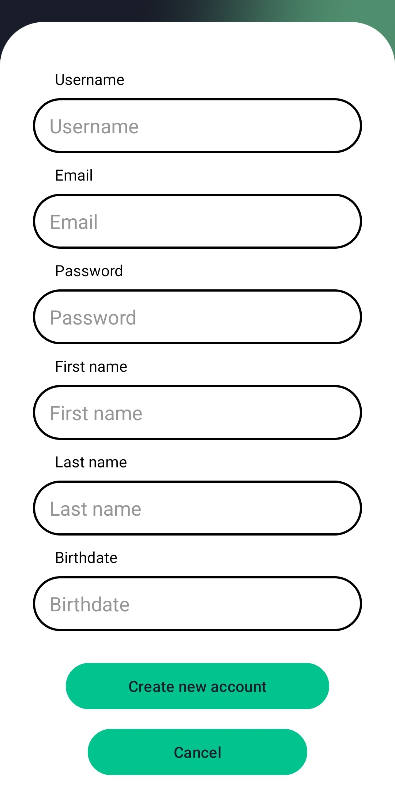
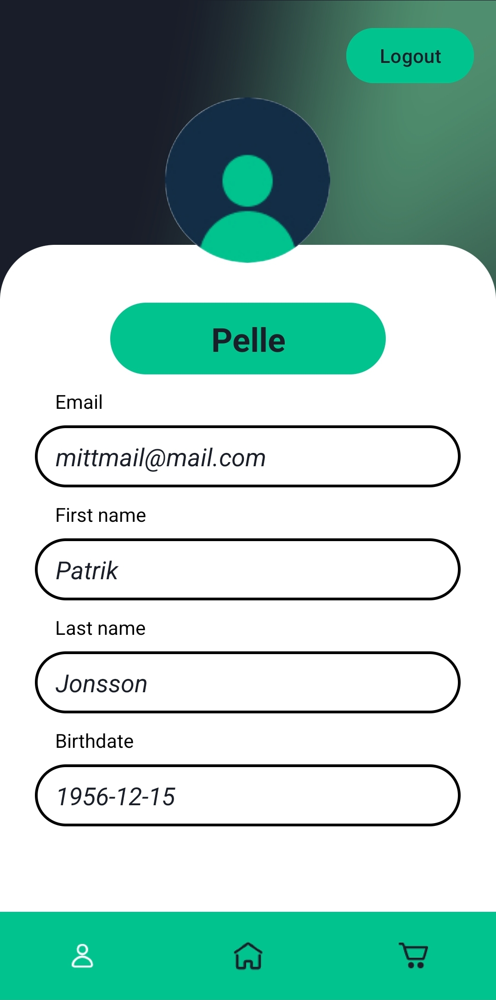
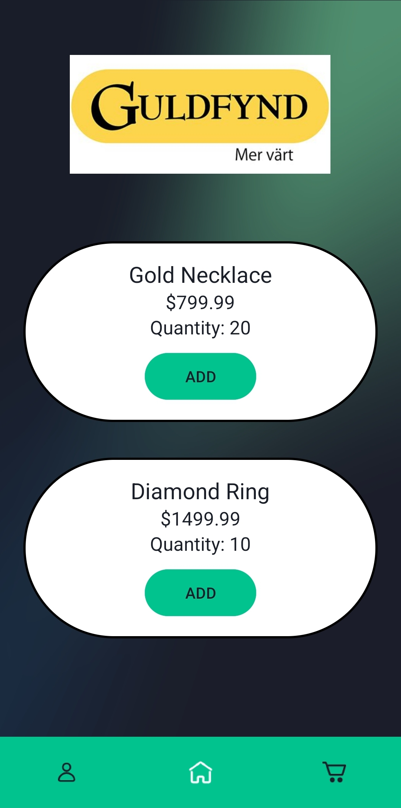
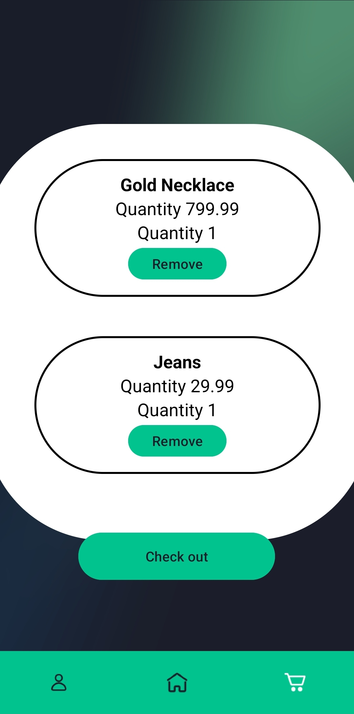
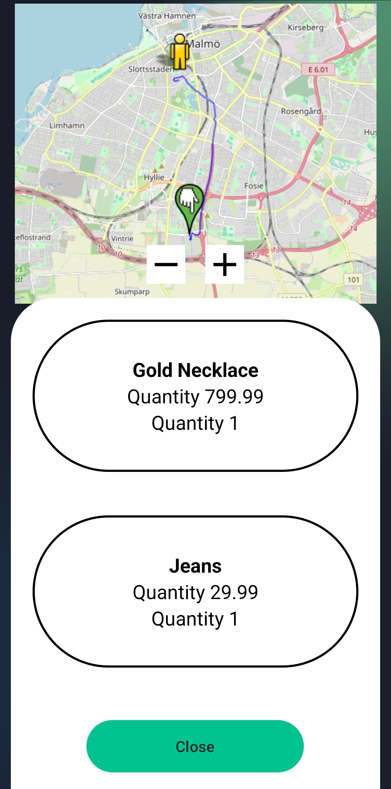

# Swifty Android App

## Table of Contents

- [Description](#description)
- [Technical Details](#technical-details)
- [Setup/Configuration](#setupconfiguration)

## Description

This Android application is developed as part of my thesis, aiming to enhance the efficiency and
accessibility of retail. Built using Java and adhering to the MVVM (Model-View-ViewModel)
architecture, the app provides a streamlined platform for retail operations.

It's important to note that this project is currently a work in progress, serving as a minimum
viable product. Over
time, it will undergo enhancements to bolster its robustness and scalability.

Current fragments in the app:

| Sign up                 | Login                    | Home                    |
| ------------------------ | ------------------------ | ------------------------ |
|   |  |  |

| Profile                 | Shop                    | Cart                    |
| ------------------------ | ------------------------ | ------------------------ |
|   |  |  |

| Profile                 |
| ------------------------ |
|   |

## Technical Details

The app is built using the following technologies:

* **Programming Language:** Java
* **Libraries:**
    * **GSON:**  Handles JSON data parsing, making it easy to work with data from APIs or local
      storage.
    * **Osmdroid:**  A powerful mapping engine used to display OpenStreetMap data efficiently. It
      manages map tiles, caching, and user interactions, providing a smooth and responsive map
      experience.
    * **OkHttp3:**  A modern, efficient HTTP client for making network requests. It handles tasks
      like connection pooling, caching, and request/response management, simplifying network
      communication within the app.
    * **Glide:**  A versatile image loading and caching library. Glide streamlines the process of
      fetching, decoding, and displaying images from various sources (including the network),
      optimizing performance and reducing memory usage.
* **Architecture:** Model-View-ViewModel (MVVM)
    * **Model:** Represents the app's data and business logic.
    * **View:**  Displays the data to the user and handles user interactions.
    * **ViewModel:** Acts as an intermediary between the Model and View, preparing data for display
      and handling user input.

## Setup/Configuration

To make the app runnable you need to connect i to the serverApplication. In app/src/main/ create a
assets folder with a config.properties file and add the following:

BASE_URL=http://{YOUR_IP}:3000/api/
LOGIN=users/loginUser
COMPANY=firebase/data?path=companies
TRANSACTION=transaction
CREATE_USER=users/register/individual

Replace YOUR_IP with the your ip-address.

Congratulation now you are all set. Just don't forget to make sure that the server application is
running first, have fun.
